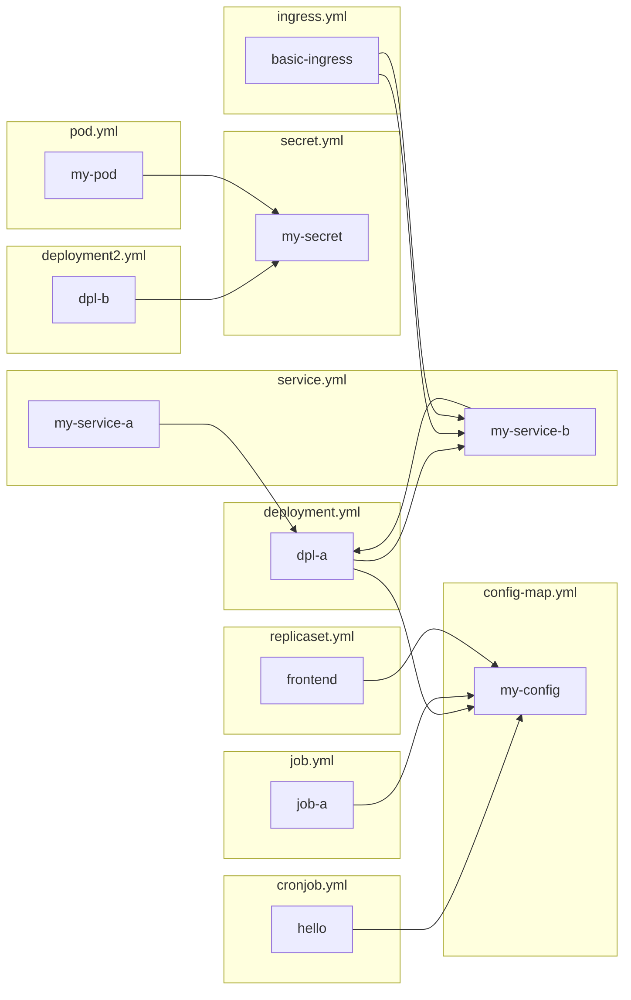

```mermaid
graph LR;
 subgraph config-map.yml; my-config; end;
 subgraph cronjob.yml; hello; end;
 hello --> my-config;
 subgraph config-map.yml; my-config; end;
 subgraph deployment.yml; dpl-a; end;
 dpl-a --> my-config;
 subgraph config-map.yml; my-config; end;
 subgraph job.yml; job-a; end;
 job-a --> my-config;
 subgraph config-map.yml; my-config; end;
 subgraph replicaset.yml; frontend; end;
 frontend --> my-config;
 subgraph service.yml; my-service-b; end;
 subgraph deployment.yml; dpl-a; end;
 dpl-a --> my-service-b;
 subgraph service.yml; my-service-b; end;
 subgraph ingress.yml; basic-ingress; end;
 basic-ingress --> my-service-b;
 subgraph service.yml; my-service-b; end;
 subgraph ingress.yml; basic-ingress; end;
 basic-ingress --> my-service-b;
 subgraph secret.yml; my-secret; end;
 subgraph deployment2.yml; dpl-b; end;
 dpl-b --> my-secret;
 subgraph secret.yml; my-secret; end;
 subgraph pod.yml; my-pod; end;
 my-pod --> my-secret;
 subgraph deployment.yml; dpl-a; end;
 subgraph service.yml; my-service-b; end;
 my-service-b --> dpl-a;
 subgraph deployment.yml; dpl-a; end;
 subgraph service.yml; my-service-a; end;
 my-service-a --> dpl-a;
```